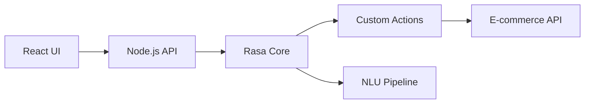

# Rasa E-commerce Assistant

[](https://www.python.org/downloads/)
[](https://rasa.com/docs/)
[](https://reactjs.org/)

## Overview

Intelligent chatbot for e-commerce customer support built with Rasa framework. Handles order tracking, product inquiries, and customer service through natural language conversations.

## Features

- **Order Management**: Track orders with ID validation, return policy assistance
- **Product Support**: Search products, check inventory, provide specifications  
- **Smart Conversations**: Intent recognition, entity extraction, context awareness
- **Customer Service**: Payment support, shipping info, mood-based responses

## Tech Stack

- **AI Framework**: Rasa Open Source 3.x
- **Frontend**: React.js
- **Backend**: Node.js/Express
- **Language**: Python 3.8+
- **NLP**: Rasa NLU + spaCy

## Architecture



## Quick Start

```bash
# Setup
git clone <repo-url>
cd rasa-ecommerce-assistant
python -m venv venv && source venv/bin/activate
pip install -r requirements.txt && npm install

# Train & Run
rasa train
rasa run --enable-api --port 5005 &
rasa run actions --port 5055 &
npm start
```

## Core Capabilities

### Supported Intents
- `track_order` - Order status with ID validation
- `return_policy` - Return process information
- `product_search` - Product discovery
- `shipping_info` - Delivery details
- `payment_methods` - Payment support

### Entity Recognition
- Order IDs, product names, payment types, shipping methods

## Project Structure

```
├── actions/           # Custom business logic
├── data/             # Training data (NLU, stories, rules)
├── src/              # React frontend
├── config.yml        # Rasa configuration
├── domain.yml        # Intents, entities, responses
└── models/           # Trained models
```

## Performance

- Response time: <200ms
- Intent accuracy: 95%+
- Concurrent users: 50+

## License

MIT License
